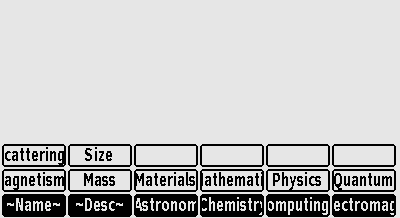
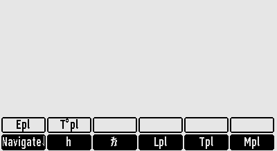
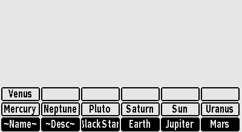
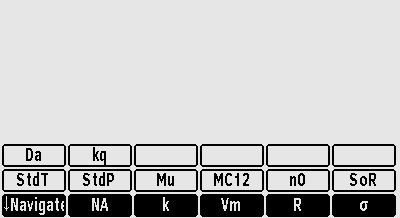
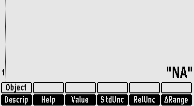
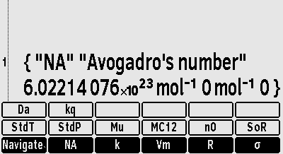
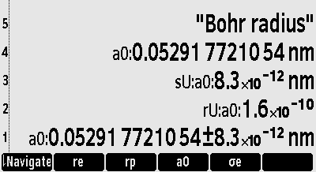
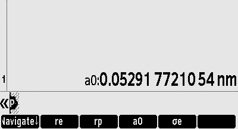
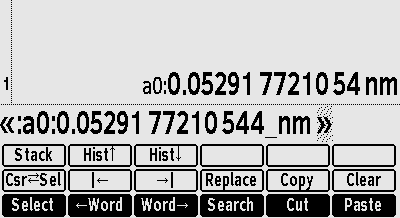

# Introduction

This is a brief preliminary description of the Constants module,
a (partial) implementation of the constants functionality in rpl.
Beware that things may change.

# Installation

The files of the module should be placed in `library/Modules/Constants`.
A section Modules should be added to`config/library.csv`.
In it, the module Constants should be added:
```
"Modules"
        "Constants",    "=/library/Modules/Constants/Initialise.48s"
```

# Activation

To load and initialise the Module Constants:
- 🟦 VAR (H = `LIB`) or the ```Library``` command,
- ... F... ( = `Modules`),
- F1 ( = `Constants`),

The above reads and evaluates `Initialise.48s`.
That bootstraps the rest of the module.
Eventualy it binds the top menu of the Constants Module to the same key as the regular constants menu,
but in Usermode.

# Use

To activate the top menu:
- 🟨 2 (Y = `USER`)
- 🟨 STK (I = `CONST`) 

The calculator shows (the top constants menu):



The menu is briefly described in the table below.
| Menu item | Description |
| :---: | --- |
| \~Name\~ | Search the database for constants with a name that contains a string. Requires a string on the stack. |
| \~Desc\~ | Search the database for constants with a (short) description that contains a string. Requires a string on the stack. |
| Astronomy | Activate the astronomy (navigation) (sub)menu. |
| Chemistry | Activate the chemistry section menu. |
| ... | Activate that (sub)menu. |

Suppose you are looking for a particular constant, you don't know its name,
but you know it is associated with the work of Max Planck.
Put "Planck" on the stack and activate the `~Desc~` button.
When the search completes, the calculator shows:



This is a constant selection menu with all the constants in the database which have "Planck" in the (short) description.
You can activate the menu button of any of the constants to work with that particular constant.
How to work with a particular constant is described below for the "NA" constant.

After activating the `Astronomy` menu button, in the top menu, the calculator shows:



Like the top menu this is a navigation menu.
It shows menu items for several celestial bodies in the solar system and for a black star.
Each such menu item wil activate the menu for the corresponding constant section.

After activating the `Chemistry` menu button, in the top menu, the calculator shows (the chemistry constant section menu):



The menu is briefly described in the table below.
| Menu item | Description |
| :---: | --- |
| ↓Navigate↓ | Move back down the menu tree (to the previous navigation menu).  |
| NA | Put "NA" on the stack and activate the menu for the NA constant |
| ... | Put the name of the constant on the stack and Activate the menu for that particular constant. |

After activating the `NA` menu button the calculator shows:



The menu is briefly described in the table below.
| Menu item | Description |
| :---: | --- |
| Descrip | Put the (short) description of the constant on the stack. |
| Help | Display the help information for the constant. |
| Value | Put the value of the constant on the stack. Tag it with the name. |
| StdUnc | Put the standard uncertainty of the constant on the stack. Tag it with the name and "sU" .|
| RelUnc | Put the relative uncertainty of the constant on the stack. Tag it with the name and "rU". |
| ∆Range | Put the value and the standard uncertainty of the constant on the stack as a ∆Range. Tag it with the name. |
| Object | Put the databse object of the constant on the stack. |

Each of these pop the name of the constant from the stack.
After the action the section menu is shown again.

With "NA" on the stack, after activating the `Object` menu button the calculator shows:



A TypeName = "list" object is put on the stack.
It contains the constants name, (short) description, value, standard and relative uncertainty.
These are the attributes for a constant in the database.

As described in the table above, each of those attributes can be put on the stack with the respective menu button.
Here is what the calculator shows after, starting from the top menu, `Size`,
`a0` `Descrip`,
`a0` `Value`,
`a0` `StdUnc`,
`a0` `RelUnc` and
`a0` `∆Range`.



Note the tags on the values.
They help identify the numbers.
This is particularly useful when the numbers are used in expressions, programs and such.

To use any of the constant attributes in an object (a program, list or matrix) which your are building on the command line,
you will need to use the `StackEditor`.
The constant menu keys will not insert their outcome in the command / edit line.
They will push it on the stack.
This behaviour is quite different from the native, as in non rpl, commands.
It is not particular for this module but a (less bright) feature of DB48x.

Suppose you want the value of the constant "a0" in a program.
Assuming you have activated the constant `Size` menu
and then entered programming mode with 🟨 = (`«PROG»`).
If you then click `a0` `Value`, the calculator shows:



So the value of "a0" is on the stack, not in the program (yet),
as pointed out above.

Activate the `StackEditor` and then the stack navigation and selection:
- 🟦 ▶︎ (`EDIT`)
- 🟦 F1 (`Stack`)

Use the ▲ and ▼ keys to select the desired stack level.
In this example level = 1.
Then copy the content of that stack level to the command / edit line:
- F1 (`Echo`)
- `EXIT`

The result shows as (it shows the StackEditor menu as well):



From there you can work further on your program with the value of the constant "a0" available in it.

If you prefer to see a symbolic value in your program, but still do the math with it,
you wil have to use the respective retrieve command:
```
ConstantRetrieveDescription
ConstantRetrieveValue
ConstantRetrieveStandardUncertainty
ConstantRetrieveRelativeUncertainty
Constant→∆Range
```
If you use them often and want to avoid DB48X related RSI, you could define short aliases:
```
'ConstantRetrieveValue' V Store
'ConstantRetrieveStandardUncertainty' sU Store
'ConstantRetrieveRelativeUncertainty' rU Store
'Constant→∆Range' V∆ Store
```
You can mix long with short and even with the algebraic form:
```
"ke" ConstantRetrieveValue
4 "π" V * "ε₀" V * Invert
'1 / (4 * V("π") * V("ε₀"))' Evaluate
```
It is a very cool feature of DB48X to make rpl commands available as algebraic functions.

# De-activation

To unload the Module Constants ...

```
UpDirectory
{ ModuleConstant } Purge
```

# Maintenance

Very, very brief ...

To generate a Constants.db file, use Define.48s and Definitions.48s.

To compare the constants in the database with `constants.cc`, use Test.48s.

To modify a Constant, edit Definitions.48s.
Generate a new database and make it available.

To modify a Section, edit Section.db.

To modify a navigation menu, edit Menu.db.